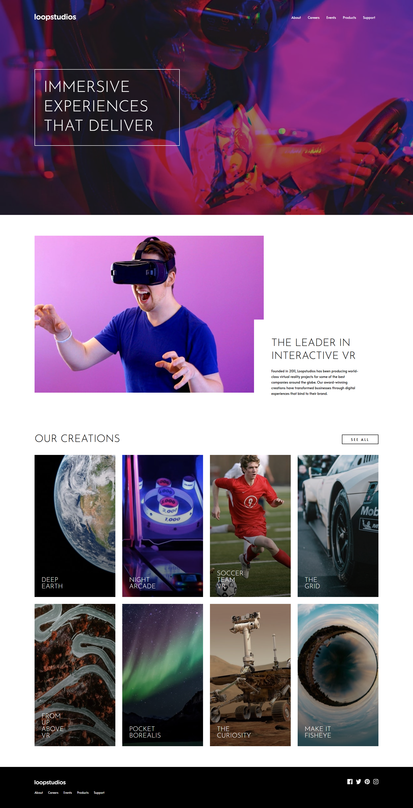

# 🏝️ Proyecto: Loopstudios Landing Page

Este proyecto consiste en el desarrollo de la **landing page de Loopstudios** utilizando **Astro** y **Tailwind CSS**.  
El objetivo es aplicar los conocimientos sobre **componentes de Astro**, **maquetación**, **estilos responsivos** y **utilidades CSS** para construir un diseño limpio, moderno y adaptable a diferentes dispositivos.

---

## 📖 Descripción general

### 🧩 Vista previa del proyecto
Agrega aquí una **captura de pantalla** del resultado final de tu landing page.  

---

### 🔗 Enlaces del proyecto

- **Repositorio en GitHub:** https://github.com/Jontrix/Loopstudio.git
- **Sitio desplegado (opcional):** https://loopstudios-lhgq4rhep-jovaniva66-7689s-projects.vercel.app/#

---

## 🧠 Proceso de desarrollo

### 🛠️ Tecnologías utilizadas
Lista las herramientas y tecnologías que utilizaste en el proyecto. Por ejemplo:

- [Astro](https://astro.build)
- [Tailwind CSS](https://tailwindcss.com/)
- HTML5 semántico
- Diseño responsivo (Mobile-first)
- Componentes de Astro reutilizables
- Interacciones con JavaScript (opcional para el toggle del menú móvil)

---

### 💡 Lo que aprendí
Lo más valioso de este proyecto fue aprender a solucionar conflictos de dependencias entre versiones mayores de software. Reforcé la importancia de la arquitectura de archivos en Astro (carpeta public vs src) y cómo configurar manualmente un entorno de diseño cuando las herramientas automáticas fallan.

### 🚀 Áreas de mejora

Menciona aquí los aspectos que podrías mejorar o seguir practicando en futuros proyectos.

Áreas de mejora
Interactividad JS: Implementar el menú lateral  para la versión móvil utilizando estados de JavaScript.

Optimización de Imágenes: Utilizar el componente <Image /> nativo de Astro para generar formatos .webp automáticamente.

Animaciones: Añadir efectos de hover más suaves y transiciones de entrada .

---

### 📚 Recursos útiles

Incluye los enlaces, documentación o tutoriales que te ayudaron a completar este proyecto.

**Ejemplo:**(de hecho estos utilice jaja)
- [Documentación de Astro](https://docs.astro.build)  
- [Guía oficial de Tailwind CSS](https://tailwindcss.com/docs)  
- [MDN Web Docs - HTML y CSS](https://developer.mozilla.org/es/)  
- [Guía de diseño responsivo](https://web.dev/responsive-web-design-basics/)  

---

### 👩‍💻 Autor

- **Nombre completo:**  Jovani Vargas Muñoz
- **Carrera:**  TICS
- **Grupo:**  11 am
- **Correo institucional:**  23151318@aguascalientes.tecnm.mx

---

### ✨ Reflexión final

Comparte brevemente tu experiencia durante el desarrollo del proyecto.  
Puedes responder a preguntas como:

- ¿Qué fue lo más fácil o lo más difícil de realizar?  Lo más retador fue la configuración inicial de Tailwind CSS v4 con Astro 6. Tuvimos que solucionar errores de dependencias (ERRESOLVE) y configurar manualmente postcss.config.mjs para que los estilos se aplicaran correctamente.

- ¿Qué parte disfrutaste más del desarrollo?   La parte de maquetar la galería de "Our Creations". Fue muy satisfactorio ver cómo una lista de datos (array) se transformaba automáticamente en una cuadrícula profesional usando map() en Astro.
- ¿Qué conceptos nuevos aprendiste?  Aprendí sobre el ciclo de vida de los hooks de configuración de Astro (astro:config:setup) y el uso de la directiva @theme en la nueva versión de Tailwind.

- ¿Cómo aplicarías lo aprendido en proyectos futuros? Aplicaré esta estructura de componentes reutilizables en mis próximos proyectos escolares para mantener un código limpio y fácil de mantener.